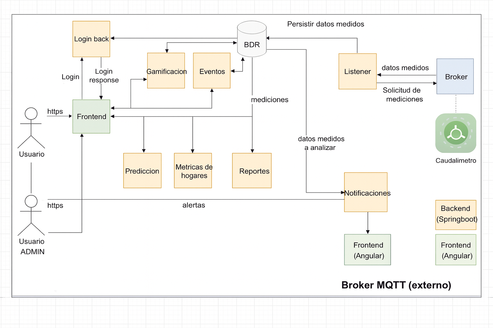
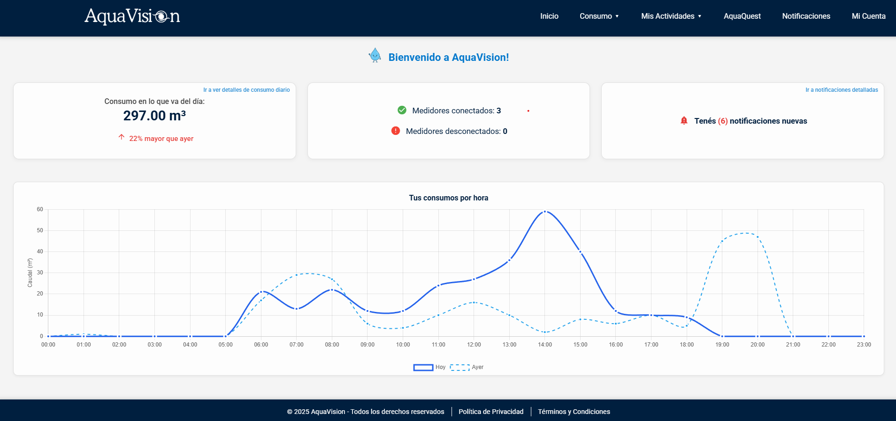
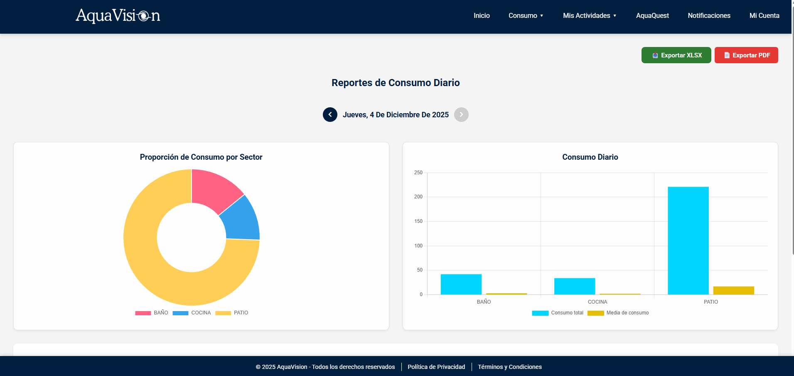
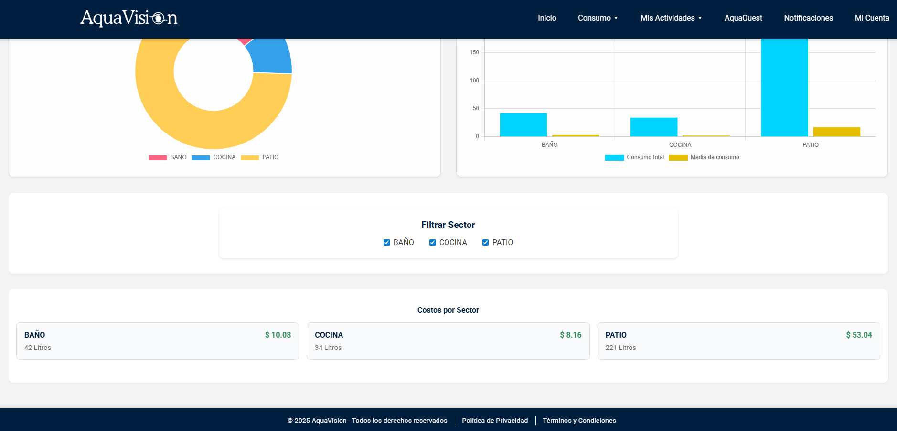
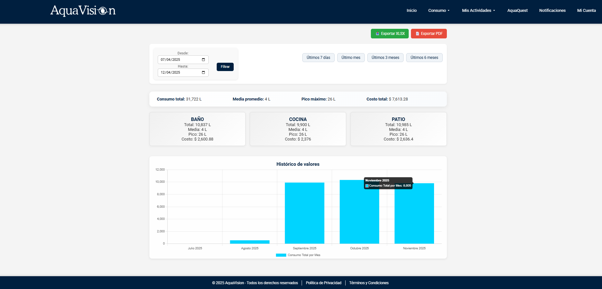
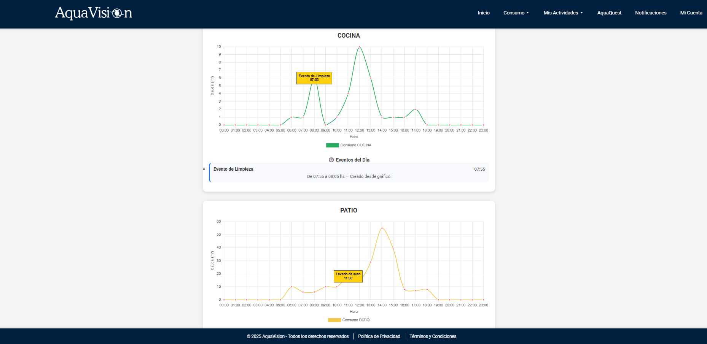
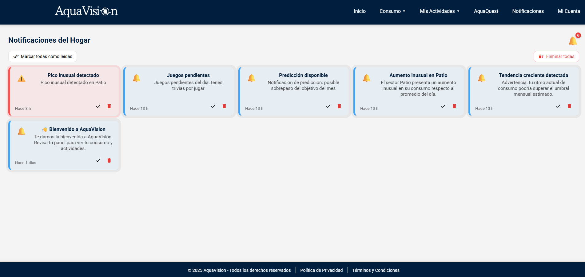
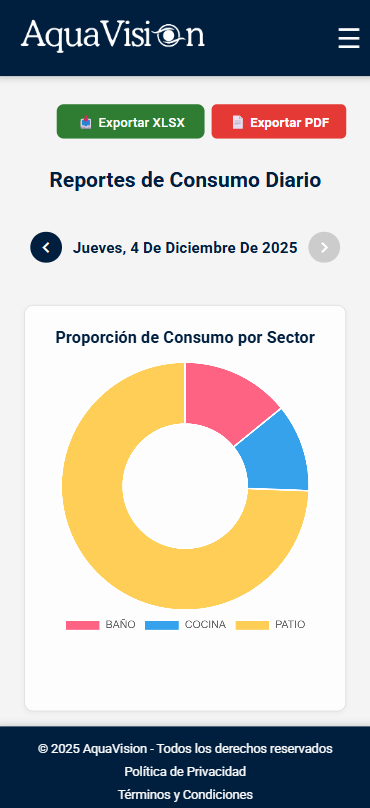
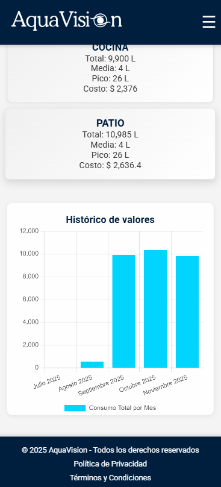
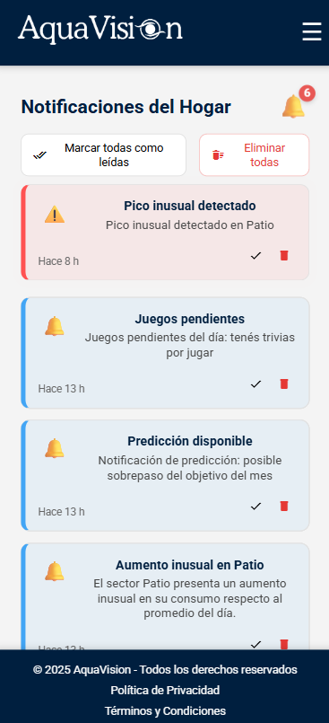

# 💧 AquaVision — Smart Water Monitoring System

AquaVision is a smart water-monitoring platform that helps households and institutions understand, analyze, and reduce daily water consumption.  
This project integrates **hardware + backend + frontend + analytics**, built as a complete engineering final project.

---

## 🌍 Problem Statement
Most households lack real-time visibility into water usage.  
Traditional meters only show cumulative numbers — making it impossible to detect leaks, waste, or inefficient habits.

**AquaVision solves this by offering real-time insights, predictions, alerts, sector-based breakdowns, and gamification tools.**

---

## 🎯 Main Objectives
- Real-time monitoring of water consumption  
- Leak and abnormal-usage detection  
- Predictive analytics & cost estimation  
- Encouraging sustainable habits via gamification  
- Exportable data for institutions  
- Scalable Smart City integration  

---

## 🧱 System Architecture

### **Hardware Layer**
- ESP32  
- Flow meter sensor  
- Wi-Fi data transmission

### **Communication Layer**
- HTTP/MQTT messages from device to server  
- Continuous flow-rate data publishing

### **Backend Layer**
- Spring Boot  
- Authentication, processing, storage, prediction models  
- REST API for frontend consumption

### **Frontend Layer**
- Angular  
- Dashboards, reports, notifications  
- Fully responsive

### 📸 Architecture Diagram  

---

# 🖥️ Features Overview

---

## ✅ Real-Time Monitoring
Track consumption live by hour, day, month, and per household sector.

### 📸 Real-Time Dashboard  

---

## ✅ Daily & Historical Reports
Generate detailed charts per sector, with consumption averages and cost estimation.

### 📸 Daily Reports  
  

### 📸 Historical Report  

---

## ✅ Activity Tracking
Register and visualize activities such as showers, dishwashing, laundry, etc., and correlate them with peaks in consumption.

### 📸 Activities Timeline (with zoom)

---

## ✅ Smart Notifications
Receive alerts about:

- Suspected leaks  
- Abnormal consumption  
- Threshold predictions  
- Device disconnection  
- Daily gamification reminders  

### 📸 Notifications Panel  

---

# 📱 Responsive Mobile Screenshots
Fully responsive design for mobile and tablet.

  
  

---

## ⭐ Tech Stack

### **Frontend**
- Angular  
- TypeScript  
- NgCharts  
- SCSS  

### **Backend**
- Spring Boot  
- Java  
- JPA / Hibernate  
- MySQL  

### **Hardware**
- ESP32  
- Flow Sensor  
- Custom firmware  

---

